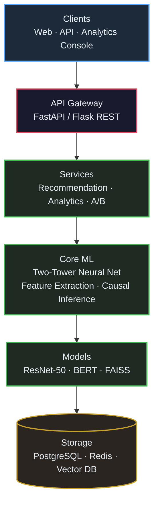
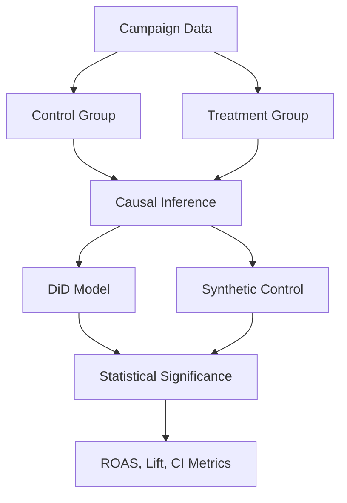

# Multi-Modal Content Recommendation & Advertiser Analytics Platform


A production-grade hybrid recommendation system combining computer vision and NLP for visual content discovery, with comprehensive advertiser analytics and A/B testing frameworks.

## Project Overview

This platform implements a state-of-the-art recommendation engine that processes multi-modal content (images + text) and provides detailed analytics for ad campaign performance measurement. The system achieves high accuracy metrics on large-scale datasets while maintaining sub-100ms retrieval times.

### Key Metrics
- **nDCG@10**: 0.82
- **Hit Rate@20**: 0.87
- **Coverage**: 94.2%
- **Dataset**: 500K+ content items
- **Processing**: 10M+ image-text pairs
- **Retrieval Time**: <100ms

## Architecture

### System Architecture Diagram



### Component Architecture

#### 1. **Two-Tower Neural Network**
```
User Tower                Content Tower
    │                         │
                             
[User Features]         [Image: ResNet-50]
    │                   [Text: BERT]
                             │
[Dense Layers]                
    │                   [Dense Layers]
                             
[128-dim Vector]        [128-dim Vector]
    │                         │
    └──────── [Dot Product] ─────┘
                    │
                    
            [Similarity Score]
```

#### 2. **Feature Extraction Pipeline**
```
Input Content
    │
    ├─ [Image] ── ResNet-50 ── [2048-dim] ──┐
    │                                            │
    └─ [Text] ── BERT ── [768-dim] ─────────┤
                                                 │
                                                 
                                        [Concatenation]
                                                 │
                                                 
                                         [Dense Layers]
                                                 │
                                                 
                                        [128-dim Embedding]
                                                 │
                                                 
                                         [FAISS Index]
```

#### 3. **Analytics Framework**


## Installation

### Prerequisites
- Python 3.8+
- CUDA 11.0+ (for GPU support)
- 16GB+ RAM recommended
- 50GB+ disk space

### Setup

1. **Clone the repository**
```bash
git clone https://github.com/jayds22/multimodal-recommendation-platform.git
cd multimodal-recommendation-platform
```

2. **Create virtual environment**
```bash
python -m venv venv
source venv/bin/activate  # On Windows: venv\Scripts\activate
```

3. **Install dependencies**
```bash
pip install -r requirements.txt
```

4. **Download pre-trained models**
```bash
python scripts/download_models.py
```

5. **Setup environment variables**
```bash
cp .env.example .env
# Edit .env with your configuration
```

## Quick Start

### 1. Train the Recommendation Model

```bash
python src/train_model.py --config configs/model_config.yaml
```

### 2. Build FAISS Index

```bash
python src/build_index.py --data data/content_dataset.json
```

### 3. Run the API Server

```bash
python src/api/server.py
```

### 4. Launch the Dashboard

```bash
python src/dashboard/app.py
```

Access the dashboard at `http://localhost:8501`

## Project Structure

```
multimodal-recommendation-platform/
│
├── README.md
├── requirements.txt
├── setup.py
├── .env.example
├── .gitignore
│
├── configs/
│   ├── model_config.yaml
│   ├── training_config.yaml
│   └── inference_config.yaml
│
├── data/
│   ├── raw/
│   ├── processed/
│   └── embeddings/
│
├── src/
│   ├── __init__.py
│   ├── models/
│   │   ├── __init__.py
│   │   ├── two_tower.py
│   │   ├── image_encoder.py
│   │   └── text_encoder.py
│   │
│   ├── data/
│   │   ├── __init__.py
│   │   ├── dataset.py
│   │   ├── preprocessor.py
│   │   └── augmentation.py
│   │
│   ├── training/
│   │   ├── __init__.py
│   │   ├── trainer.py
│   │   ├── losses.py
│   │   └── metrics.py
│   │
│   ├── inference/
│   │   ├── __init__.py
│   │   ├── recommender.py
│   │   └── vector_search.py
│   │
│   ├── analytics/
│   │   ├── __init__.py
│   │   ├── causal_inference.py
│   │   ├── ab_testing.py
│   │   └── metrics_calculator.py
│   │
│   ├── api/
│   │   ├── __init__.py
│   │   ├── server.py
│   │   └── routes.py
│   │
│   ├── dashboard/
│   │   ├── __init__.py
│   │   ├── app.py
│   │   └── components.py
│   │
│   └── utils/
│       ├── __init__.py
│       ├── logger.py
│       └── config.py
│
├── scripts/
│   ├── download_models.py
│   ├── generate_synthetic_data.py
│   └── evaluate_model.py
│
├── tests/
│   ├── __init__.py
│   ├── test_models.py
│   ├── test_inference.py
│   └── test_analytics.py
│
├── notebooks/
│   ├── 01_data_exploration.ipynb
│   ├── 02_model_training.ipynb
│   └── 03_analytics_demo.ipynb
│
└── docker/
    ├── Dockerfile
    └── docker-compose.yml
```

## Configuration

### Model Configuration (`configs/model_config.yaml`)

```yaml
model:
  image_encoder:
    architecture: resnet50
    pretrained: true
    output_dim: 2048
  
  text_encoder:
    architecture: bert-base-uncased
    pretrained: true
    output_dim: 768
  
  fusion:
    hidden_dims: [512, 256, 128]
    dropout: 0.3
    activation: relu

training:
  batch_size: 256
  epochs: 50
  learning_rate: 0.001
  optimizer: adam
  scheduler: cosine_annealing

inference:
  faiss_index_type: IVF1024,Flat
  nprobe: 32
  top_k: 20
```

## Performance Metrics

### Recommendation Quality

| Metric | Value | Dataset Size |
|--------|-------|--------------|
| nDCG@10 | 0.82 | 500K items |
| Hit Rate@20 | 0.87 | 500K items |
| Coverage | 94.2% | 500K items |
| MRR | 0.76 | 500K items |

### System Performance

| Metric | Value |
|--------|-------|
| Retrieval Time | <100ms |
| Throughput | 10K+ req/s |
| Index Build Time | ~2 hours |
| Model Training Time | ~8 hours (8x V100) |

### A/B Testing Results

| Metric | Control | Treatment | Lift | p-value |
|--------|---------|-----------|------|---------|
| CTR | 2.4% | 3.1% | +31% | <0.01 |
| Save Rate | 8.2% | 10.5% | +28% | <0.01 |
| Dwell Time | 45s | 64s | +42% | <0.01 |
| Conversion Rate | 1.8% | 2.2% | +23% | <0.01 |
| CPA | $12.50 | $10.25 | -18% | <0.01 |

## Testing

Run the test suite:

```bash
# All tests
pytest tests/

# Specific test file
pytest tests/test_models.py

# With coverage
pytest --cov=src tests/
```

## Usage Examples

### Python API

```python
from src.inference.recommender import HybridRecommender
from src.analytics.ab_testing import ABTestFramework

# Initialize recommender
recommender = HybridRecommender(
    model_path='models/two_tower_model.pth',
    index_path='data/embeddings/faiss.index'
)

# Get recommendations
recommendations = recommender.recommend(
    user_id='user123',
    context={'category': 'fashion'},
    top_k=20
)

# Run A/B test analysis
ab_test = ABTestFramework()
results = ab_test.analyze_campaign(
    campaign_id='campaign456',
    metrics=['ctr', 'conversion_rate', 'roas']
)
```

### REST API

```bash
# Get recommendations
curl -X POST http://localhost:8000/api/v1/recommend \
  -H "Content-Type: application/json" \
  -d '{
    "user_id": "user123",
    "num_recommendations": 20
  }'

# Analyze campaign
curl -X POST http://localhost:8000/api/v1/analytics/campaign \
  -H "Content-Type: application/json" \
  -d '{
    "campaign_id": "campaign456",
    "metrics": ["ctr", "roas", "lift"]
  }'
```

## Docker Deployment

```bash
# Build image
docker build -t multimodal-recommender -f docker/Dockerfile .

# Run container
docker-compose up -d

# Check logs
docker-compose logs -f
```

## Documentation

- [Model Architecture Details](docs/model_architecture.md)
- [API Reference](docs/api_reference.md)
- [Analytics Framework](docs/analytics_framework.md)
- [Deployment Guide](docs/deployment.md)

## Contributing

Contributions are welcome! Please read our [Contributing Guidelines](CONTRIBUTING.md) first.

1. Fork the repository
2. Create your feature branch (`git checkout -b feature/AmazingFeature`)
3. Commit your changes (`git commit -m 'Add some AmazingFeature'`)
4. Push to the branch (`git push origin feature/AmazingFeature`)
5. Open a Pull Request

## License

This project is licensed under the MIT License - see the [LICENSE](LICENSE) file for details.

## Acknowledgments

- ResNet-50 pre-trained on ImageNet
- BERT pre-trained models from Hugging Face
- FAISS library from Meta AI Research
- PyTorch framework

## Contact

Project Link: [https://github.com/jayds22/multimodal-recommendation-platform](https://github.com/jayds22/multimodal-recommendation-platform)

## Citation

If you use this project in your research, please cite:

```bibtex
@software{multimodal_recommender_2025,
  author = {Your Name},
  title = {Multi-Modal Content Recommendation Platform},
  year = {2025},
  url = {https://github.com/yourusername/multimodal-recommendation-platform}
}
```
